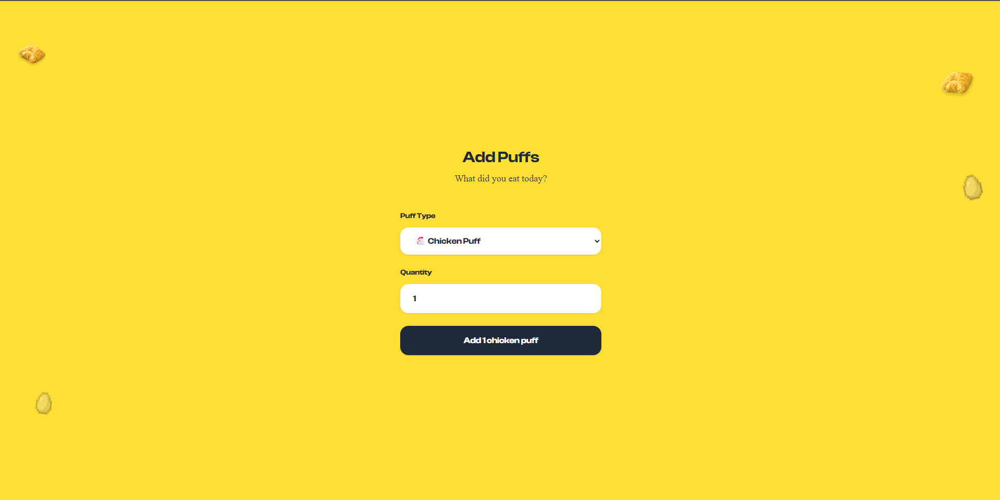

# [Hail mottapuffs] 🎯

## Basic Details
### Team Name: [Ex]

### Team Members
- Team Lead: [Habeeb Rahman K] - [College of engineering perumon, kollam]
- Member 2: [Sharan S Kumar] - [College of engineering perumon, kollam]

### Project Description
[we let people know about the amount of puffs in the shop near by college, its the most important talk at campus.]

### The Problem (that doesn't exist)
[people used to complain that they didnt get puffs by the time when they reached the shop.] 

### The Solution (that nobody asked for)
[Real time web dashboard with puffs with rewarding system for people who buy want to buy a puffs, leaderboard, badges and tempting messages]

## Technical Details
### Technologies/Components Used
For Software:
-**Languages used**: JavaScript (ES6+), HTML5, CSS3
- **Frontend Framework**: React 19.1.1 with Vite 7.1.1
- **Backend**: Node.js with Express.js
- **Database**: Supabase (PostgreSQL) with real-time subscriptions
- **Styling**: Tailwind CSS with custom components
- **Routing**: React Router DOM
- **State Management**: React Hooks (useState, useEffect)
- **Build Tools**: Vite for fast development and optimized builds
- **Deployment**: Vercel for frontend, Railway/Vercel for backend
- **Version Control**: Git & GitHub

### Implementation
For Software:
# Clone the repository
git clone https://github.com/your-username/mottapuffs.git
cd mottapuffs

# Install frontend dependencies
cd client
npm install

# Install backend dependencies (if running locally)
cd ../server
npm install

- Set up environment variables
- Create .env file in client directory with:
- VITE_SUPABASE_URL=your_supabase_url
- VITE_SUPABASE_ANON_KEY=your_supabase_anon_key

# Run

Start the frontend (from client directory)
cd client
npm run dev

# Start the backend server (from server directory, if needed)
cd server
npm start

# Or access the deployed version at:
 https://mottapuffs.vercel.app
use https://mottapuffs.vercel.app/add to check how the people buying puffs will reduce it from the naptol dashboard

### Project Documentation
For Software:

# Screenshots (Add at least 3)
](Add screenshot 1 here with proper name)
*puffs vanganulla window*

)
*live puffs count with dynamic msges*

)
*best puffer leaderboard*

## Team Contributions
- [Sharan]: [Design]
- [Habeeb]: [Devolopment]

---
Made with ❤️ at TinkerHub Useless Projects 

